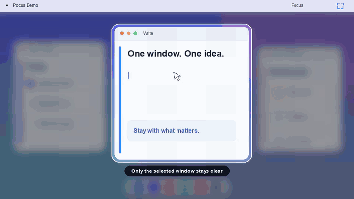

# Pocus

Pocus is a small, native macOS menu-bar app that keeps your selected window clear while blurring and dimming everything around it. Change windows normally and the focus area follows the selected window across displays and Spaces.

<p align="center">
  
</p>

<p align="center">
  <a href="docs/pocus-demo.mp4">Watch or download the twelve-second MP4 demo</a>
</p>

## Features

- Follows the frontmost window automatically; it does not follow the pointer.
- Handles Apple silicon and Intel Macs, multiple displays, windows that span displays, and full-screen Spaces.
- Pauses or resumes from anywhere with **Control–Option–Command–P** (`⌃⌥⌘P`).
- Offers backdrop strength and focus padding controls from the menu bar.
- Passes every click through to the apps beneath the overlay.
- Runs locally and never records, stores, or transmits screen contents.
- Checks a signed update feed and lets you install updates without replacing the app manually.

## Install

Pocus requires macOS 13 Ventura or newer.

1. Download the latest `Pocus-<version>.dmg` from the Releases page.
2. Open the DMG and drag **Pocus** onto the **Applications** shortcut.
3. Launch Pocus from Applications or Spotlight. Its white viewfinder icon appears in the menu bar; Pocus intentionally has no Dock icon or main window.
4. When prompted, enable Pocus in **System Settings → Privacy & Security → Accessibility**.

Launch Pocus from `/Applications` before granting access because macOS associates Accessibility approval with the installed app and its signature. Pocus uses the permission only to read the focused window's position and size. It does not request Screen Recording access, inspect window contents, or monitor typed keys.

The automated release workflow signs every executable and the DMG with Developer ID, submits the outer DMG so Apple notarizes it and its nested app, staples the accepted ticket to the DMG, and refuses to publish if any check fails.

## Use

1. Select any app window.
2. Pocus leaves that entire window clear and applies a blurred backdrop everywhere else.
3. Select another window normally to move the clear area to that window.
4. Click the white viewfinder in the menu bar to pause, resume, or adjust the effect.

Press `⌃⌥⌘P` at any time to pause or resume Pocus, even when another app is active. If another application already owns that shortcut, Pocus keeps running and explains the conflict in the menu.

If no regular window is selected—for example, while the desktop is active—Pocus temporarily hides the backdrop.

## Updates

Pocus uses Sparkle for in-app updates. On the second launch, Sparkle asks whether it may check automatically. If enabled, it checks once per day and uses gentle reminders; it does not turn Pocus into a foreground Dock app just to announce an update.

Its only network activity is requesting update metadata from the public appcast and downloading an update after the user approves it. Those requests never contain screen captures, window contents, window titles, or typed text.

Choose **Check for Updates…** in the menu at any time. Pocus verifies the signed appcast and the update's EdDSA signature before extraction, then asks before installing and relaunching. Automatic installation is disabled.

The production update feed must be hosted at a public HTTPS URL so installed copies can reach it without GitHub credentials. Until the release repository is configured, source builds intentionally use the non-routable `updates.invalid` placeholder and **Check for Updates…** will report that no feed is available.

The first updater-enabled version must be installed manually from its DMG. After that version is in `/Applications` and the public feed is configured, later signed releases can update through Sparkle without replacing the app by hand.

## Build and install a development copy

Development requires Xcode or the Xcode Command Line Tools.

```sh
make test
make universal-app
make install
```

`make install` builds both `arm64` and `x86_64` slices, verifies the app, preserves an existing `/Applications/Pocus.app` as a timestamped backup, installs the new copy, and launches it. Development builds are ad-hoc signed; use the release workflow for a build intended for other people.

Other useful commands:

```sh
make app             # Build for the current Mac only
make dmg             # Build and verify a local drag-to-Applications DMG
make update-fixture  # Create two locally signed versions for an update test
```

## Release setup

Releases are intentionally fail-closed. Configure these GitHub repository values before pushing a `v<version>` tag or manually running the Release workflow:

| Kind | Name | Purpose |
| --- | --- | --- |
| Variable | `UPDATE_FEED_REPOSITORY` | Public repository in `owner/name` form used only for downloadable update releases |
| Secret | `UPDATE_FEED_TOKEN` | Fine-grained token with Releases/Contents write access to that public repository |
| Secret | `MACOS_CERTIFICATE_P12` | Base64-encoded Developer ID Application certificate and private key |
| Secret | `MACOS_CERTIFICATE_PASSWORD` | Password protecting the P12 file |
| Secret | `MACOS_SIGNING_IDENTITY` | Full `Developer ID Application: …` identity name |
| Secret | `APPLE_ID` | Apple Developer account used by `notarytool` |
| Secret | `APPLE_TEAM_ID` | Apple Developer team identifier |
| Secret | `APPLE_APP_PASSWORD` | App-specific password for notarization |
| Secret | `SPARKLE_PRIVATE_KEY` | Private key matching `SUPublicEDKey` in `Resources/Info.plist` |

The private source repository remains private. Only the notarized DMG, checksum, release notes, and signed `appcast.xml` are copied to the public update repository. No signing or notarization secret is written to the repository or uploaded as an artifact.

Create a release with:

```sh
git tag v0.3.0
git push origin v0.3.0
```

The workflow builds a universal app, enforces Developer ID, secure timestamp, and Hardened Runtime checks on every nested executable, signs the outer DMG, requires an issue-free `Accepted` notarization result covering the DMG and nested app, staples and validates the ticket, generates the signed Sparkle appcast, publishes the public update, and records the same artifacts on the source release.

## Architecture

Pocus is implemented with AppKit, the macOS Accessibility API, `NSVisualEffectView`, Carbon's system hot-key registration API, and Sparkle 2. The application target supports macOS 13 and newer. CI builds and verifies a universal binary on each pull request.
